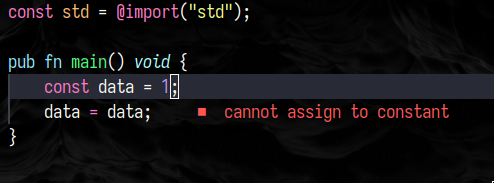
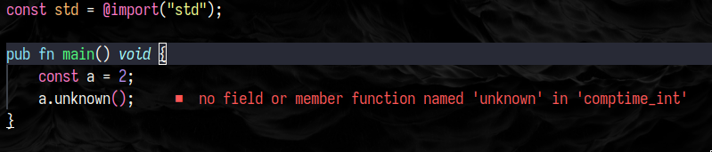
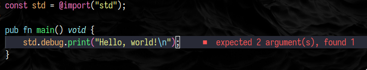

# zig-comp-diag.nvim
- Neovim plugin to show diagnostic from zig compiler

## Background
- ZLS is great but it doesn't catch many common compiler errors.
- This plugin attempts to fill in the remaining gaps using zig compiler's error messages.
- This project is motivated from the fact that I spent way too much time bouncing from compiler error messages to neovim.

## What it does?
- Using your system's installed zig, this plugin will attempt to build your project using `zig build` (default) or predefined command.
- This plugin then parses output from the stderr, map them into neovim diagnostic and sets them to respective buffers.

## Screenshots
Below are some common scenarios that ZLS is not able to catch





## Install
Using [lazy.nvim][https://github.com/folke/lazy.nvim]:
```lua
{
  'speed2exe/zig-comp-diag.nvim',
  config = function()
    require('zig-comp-diag').setup()
  end
}
```

Using [packer.nvim][https://github.com/wbthomason/packer.nvim]:
```lua
use {
 'speed2exe/zig-comp-diag.nvim',
  config = function()
    require('zig-comp-diag').setup()
  end
}
```

## Usage
Using VimL:
```vim
" runs with command: zig build
:ZigCompDiag

" runs with your custome command
:ZigCompDiag zig build-exe main.zig
```

```lua
-- run with `zig build`
require('zig-comp-diag').run()
-- run with your custom zig command
require('zig-comp-diag').runWithCmd({ "zig", "build-exe", "main.zig" })
```

## Note
- Each command runs in background and does not block user input.
- You might need to wait a little while for commands to complete to see the diagnostics.
